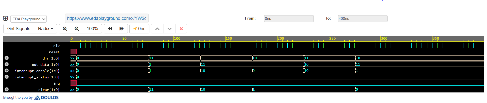

# GPIO Controller (RTL + Verification)

## 📌 Description

This project implements a **2-bit GPIO (General Purpose Input/Output) Controller** using SystemVerilog RTL with **bidirectional GPIO pins (inout)**. The controller supports configurable input/output operation, tri-state control, edge-based interrupt generation, interrupt clearing, and complete functional verification using a modular SystemVerilog testbench.

---

## ⚙️ Features

- Bidirectional GPIO (inout)
- Input / Output Direction Control
- Tri-State Driver
- Input Sampling
- Edge Detection
- Interrupt Generation
- Interrupt Clear
- IRQ Output
- SystemVerilog RTL
- Complete Verification Environment

---

## 🧠 RTL Architecture


---

## 🔄 Flow Chart


---

## 🧪 Verification Architecture


The verification environment consists of:

- Generator
- Driver
- Interface
- Monitor
- Scoreboard
- Environment
- Transaction
- Test
- Top Module

---

## 📊 Simulation

Simulation completed using:

- EDA Playground
- EPWave

### Simulation Link

https://www.edaplayground.com/x/YW2c

### Simulation Output

The waveform verifies the following functionalities:

- Reset Operation
- Bidirectional GPIO Configuration
- Input / Output Direction Control
- Tri-State (High-Z) Operation
- Input Sampling
- Edge Detection
- Interrupt Generation
- Interrupt Clear
- IRQ Assertion



---

## 📁 Project Structure

```
rtl/
    gpio_controller.sv

svtb/
    driver.sv
    environment.sv
    generator.sv
    interface.sv
    monitor.sv
    scoreboard.sv
    test.sv
    top.sv
    transaction.sv

docs/
    block diagram.png
    flow chart.png
    test bench flow diagram.png
    waveform.png

README.md
```

---

## 🛠️ Tools Used

- SystemVerilog
- EDA Playground
- EPWave

---

## 🚀 Applications

- FPGA Designs
- Embedded Systems
- SoC GPIO Peripheral
- Digital System Design
- Interrupt Controller Design

---

## 🔮 Future Improvements

- Parameterized GPIO Width
- APB Bus Interface
- Configurable Edge Triggering
- Debounce Logic
- Low-Power GPIO Support

---

## 👨‍💻 Contributor

**Pavan D D**
